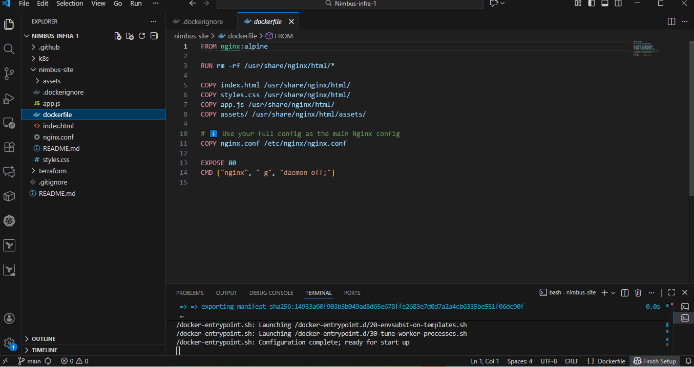
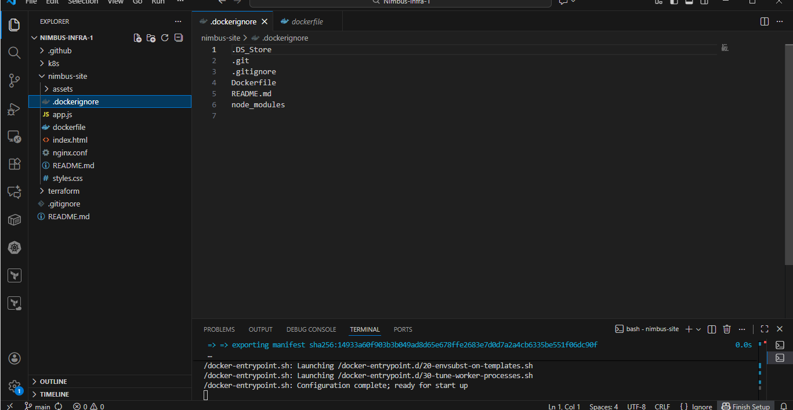
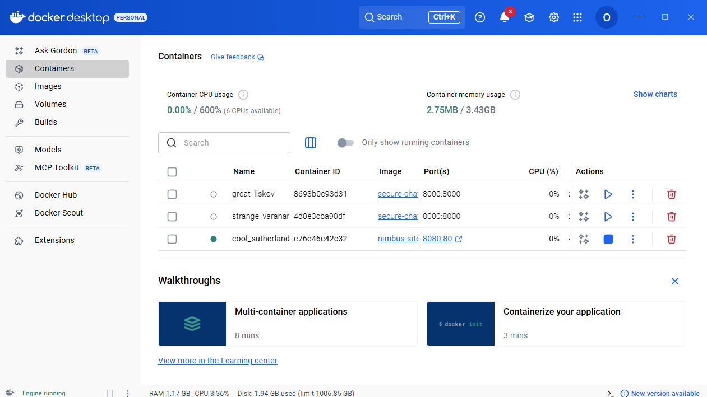
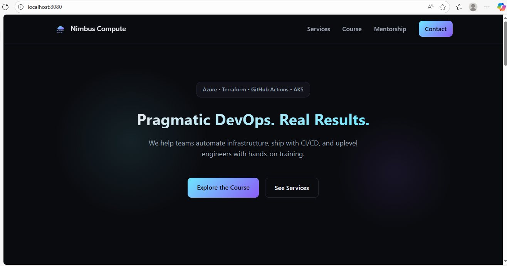
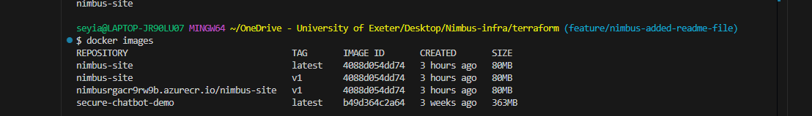
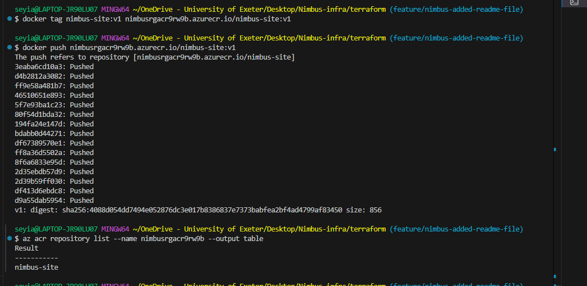
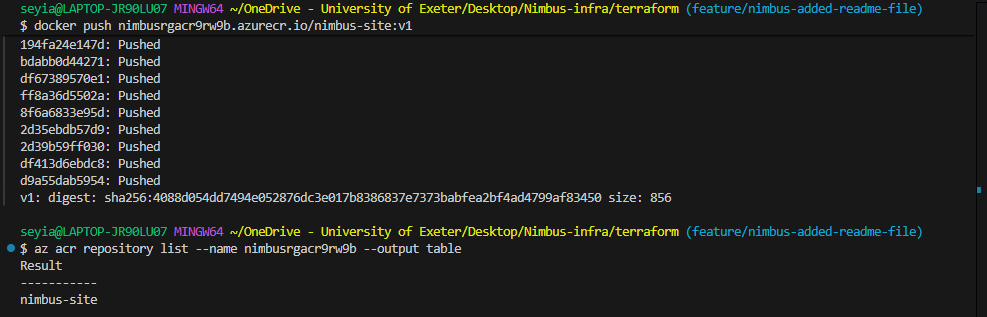
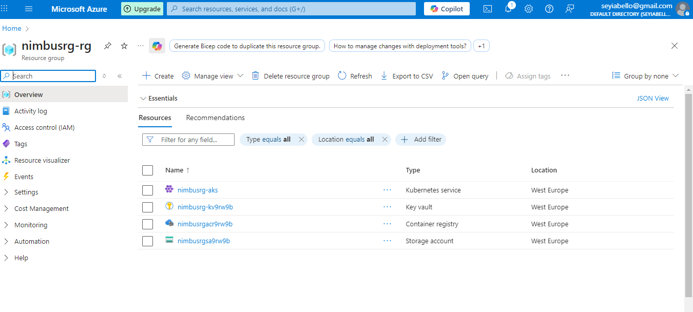
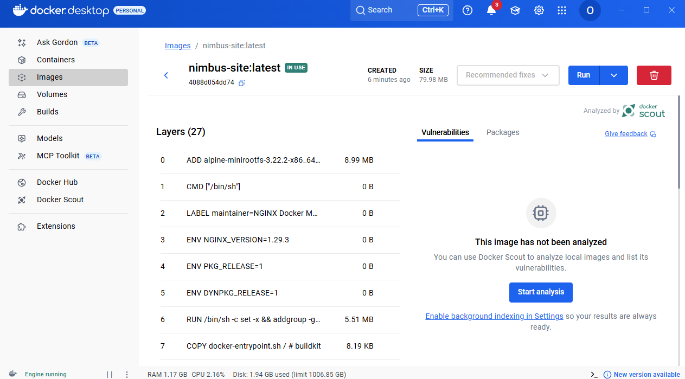

🌩️ Nimbus Docker Project – Containerization for DevOps Engineers

 A complete hands-on Docker project demonstrating how to build, run, and deploy containerized applications using <strong>Docker</strong> and <strong>Azure Container Registry (ACR)</strong>.  This project is part of the Nimbus DevOps series, designed to teach real-world containerization and cloud deployment workflows. 

🚀 Project Overview

 <b>Docker + Azure ACR = Production-Ready Containerized Applications</b>  This project shows how to write a Dockerfile, containerize a web application, run it locally, inspect it with Docker Desktop, and finally push your image to Azure Container Registry for cloud deployment. 

🧱 Core Docker Skills Demonstrated
🐳 Docker Fundamentals

Containers vs Virtual Machines

Images vs Containers

Layered Filesystem

Docker CLI + Docker Desktop

📦 Application Containerization

Writing a production-grade Dockerfile

Creating .dockerignore

Building images with docker build

Running containers locally with port mapping

☁️ Cloud Deployment (Azure Container Registry)

Logging into ACR

Tagging Docker images for registries

Pushing images to Azure

Viewing repositories & tags in Azure Portal

Understanding versioning (:v1, :latest)

📝 Step-by-Step Breakdown
🎥 1️⃣ Understanding Docker

What students learn in this phase:

What Docker is & how it differs from virtualization

Why containers are essential in CI/CD pipelines

How Docker ensures consistent Dev → Test → Prod environments

Installing Docker Desktop & Docker CLI

What a Dockerfile is and its purpose

How containers revolutionize app deployment

🧱 2️⃣ Writing & Building the Dockerfile
📄 Dockerfile

  

📄 .dockerignore

  

▶ Commands Used
docker build -t nimbus-site:latest .
docker run --rm -p 8080:80 nimbus-site:latest

📸 Running Container in Docker Desktop

  

📸 Application Running at http://localhost:8080

  

☁️ 3️⃣ Deploying to Azure Container Registry (ACR)
Steps Covered

Login to ACR

Tag local image with registry hostname

Push to ACR

Verify container image in Azure Portal

▶ Commands Used
az acr login --name nimbusrgacr9rw9b
docker tag nimbus-site:latest nimbusrgacr9rw9b.azurecr.io/nimbus-site:v1
docker push nimbusrgacr9rw9b.azurecr.io/nimbus-site:v1

📸 Local Images Before Push

  

📸 Tagging & Pushing to ACR

  

📸 ACR Push Output

  

📸 Azure Resource Group

  

📸 ACR Repository View

  

📁 Repository Structure
code/
└── nimbus-site/
    ├── assets/
    ├── app.js
    ├── index.html
    ├── styles.css
    ├── nginx.conf
    ├── Dockerfile
    ├── .dockerignore
    └── README.md

images/
├── azure repositories.png
├── containers.png
├── dockerfile.png
├── dockerignore.png
├── dockerimages.png
├── layers.png
├── nimbus-rg.png
├── pushed.png
├── site.png
└── taggedandpushed.png

🔗 View the Application Code

  

📸 Additional Technical Screenshots
🧩 Docker Image Layers (Docker Scout)

  

🧠 Skills Demonstrated
Category	Skills
Docker	Dockerfile, layers, images, containers, .dockerignore, port mapping
DevOps	Containerization, reproducible builds, local → cloud workflow
Azure	ACR login, ACR tagging, pushing, repository inspection
Tooling	Docker Desktop analysis, CLI operations
🎯 Project Outcome

This project demonstrates end-to-end Docker competency:

✔ Application successfully Dockerized
✔ Container runs locally using Docker Desktop
✔ Image tagged and pushed to Azure Container Registry
✔ Cloud-hosted container image ready for CI/CD or Kubernetes
✔ Real-world DevOps workflow from local → cloud

<b>This is a production-style project that proves your ability to containerize and ship applications like a real DevOps engineer.</b>
